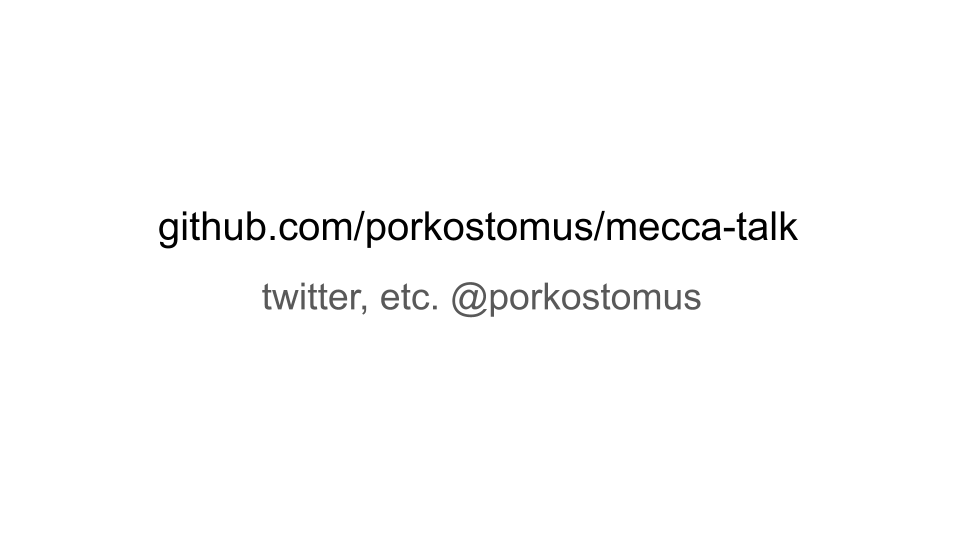
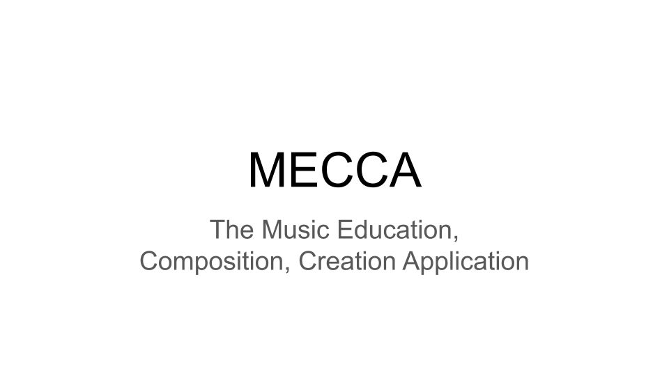
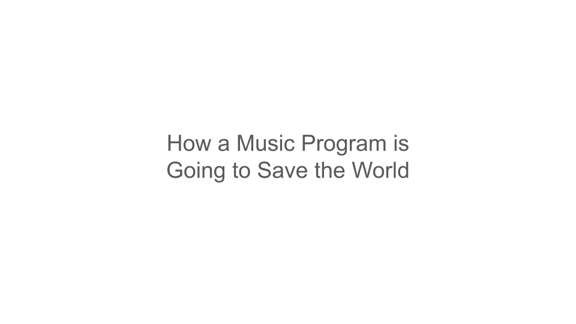
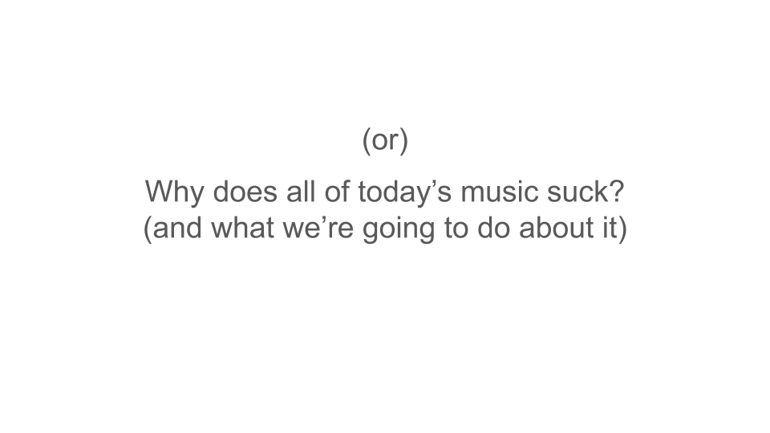
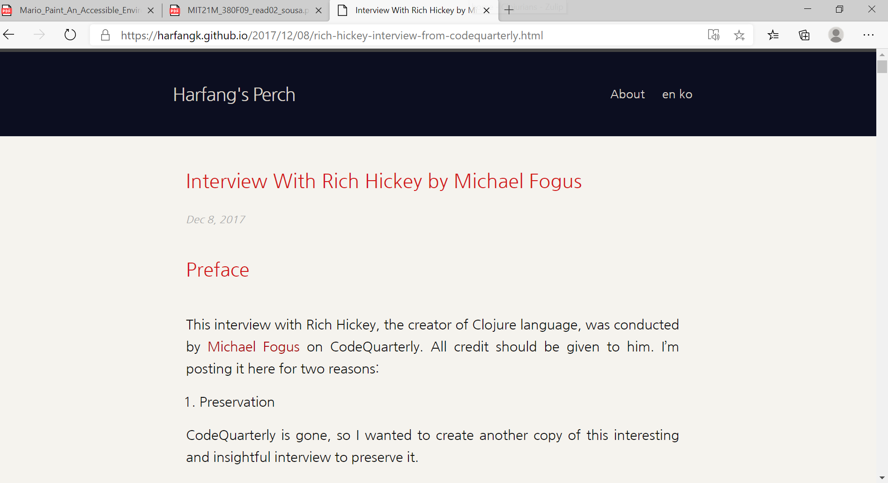
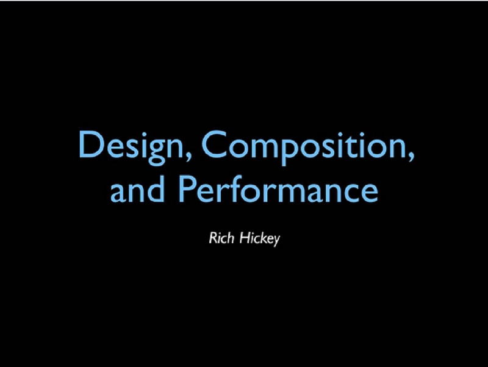

# mecca-talk
Script and slides for MECCA history and demo

First off, point the audience to *this repo*:

So much more went into the preparation of this talk than I could possibly cover in one session, but I've prepared a detailed bibliography which is available on GitHub @porkostomus [show link] along with all the slides and many of my notes.

Rejected titles for today's talk:

It was only this year that I discovered through reading this [Interview With Rich Hickey by Michael Fogus](https://harfangk.github.io/2017/12/08/rich-hickey-interview-from-codequarterly.html) that before becoming a programmer he was a musician and ran a recording studio, and cut his programming teeth by writing music software.

In my favorite of his "classic" talks, ["Design, Composition and Performance"](https://github.com/matthiasn/talk-transcripts/blob/master/Hickey_Rich/DesignCompositionPerformance.md), he does an amazing job of framing software design in terms of music. Many of the ideas explored are common to the motivations of this project, [MECCA](https://github.com/porkostomus/mecca) that I'll be discussing today, so much that it is a shocking fact that I came to them entirely on my own, when I'd only heard of Clojure. The similarity is right down to the title! Both express the same point of distinguishing the processes involved in making things.

There has been no shortage of music libraries for Clojure. Rich even has one, called [harmonikit](https://github.com/richhickey/harmonikit). That and several others have been a huge inspiration, though I've approached the space from a decidingly different angle and set of constraints.

Specifically:

- [Overtone](https://github.com/overtone/overtone) (Sam Aaron et al, Harmonikit uses this)
- [Alda](https://github.com/alda-lang/alda), [Mantra](https://github.com/daveyarwood/mantra), [Chronoid](https://github.com/daveyarwood/chronoid) (Dave Yarwood)
- [cljs-bach](https://github.com/ctford/cljs-bach), [leipzig](https://github.com/ctford/leipzig), etc. (Chris Ford)
- [sonic-cljs](https://github.com/bhauman/sonic-cljs) (Bruce Hauman)

Eventually we'll get to the daughter projects that were spawned* from this one, including:

- MECCA-pix

*spawned, an intentional pun on game development lingo. Talk about working in the pizzeria and comparing the dough prep to Play-Doh and Sam's reaction, because it *perfectly* embodies our intention. The best way to teach is when the student doesn't even realize they are learning!